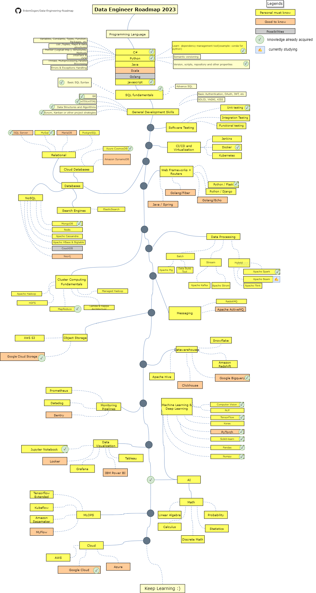

# My-personal-roadmap-for-2023
 A repository that organizes together everything that has ever been produced in all the others as a learning tree

This tree was originally created by the : 
[ErdemOzgen/Data-Engineering-Roadmap ](https://github.com/ErdemOzgen/Data-Engineering-Roadmap) 
I ended up making some modifications and adding other images:

# Skill tree and study guide for 2023

# Comments

this tree does not fully reflect all the knowledge I have acquired, just a guide to what has already been done in relation to the road-map of a data engineer.

# Python, Mathematical methods, Jupyter notebook and Machine Learning 

1- [Credit-score-challenge ](https://github.com/MatheusAraujoSouza/Credit-score-challenge) 
2- [Interior-Points](https://github.com/MatheusAraujoSouza/MS428-Pontos-Interiores--Interior-Points-) 
3- [Unrestricted-minimization ](https://github.com/MatheusAraujoSouza/MS629-unrestricted-minimization) 
4- [Modeling-mathematics-PDE-](https://github.com/MatheusAraujoSouza/MS480-Modelagem-Matematica-EDP--modeling-mathematics-PDE-) 
5- [Data-Modeling-with-Python- ](https://github.com/MatheusAraujoSouza/Data-Modeling-with-Python-) 
6- [Numerical-Analysis-I-projects](https://github.com/MatheusAraujoSouza/MS512-Numerical-Analysis-I-projects) 
7- [Projetos-do-curso--Course-projects- ](https://github.com/MatheusAraujoSouza/MS211--Projetos-do-curso--Course-projects-) 
8- [Topics-in-Data-Science-Applied-to-Business-TradeMap-project](https://github.com/MatheusAraujoSouza/MS902-Topics-in-Data-Science-Applied-to-Business-TradeMap-project) 
8- [Machine-learning--Course-Projects](https://github.com/MatheusAraujoSouza/MS960-Machine-learning--Course-Projects) 
9- [Computational-Project-Mixture-of-Ores-with-Quality-Goals](https://github.com/MatheusAraujoSouza/MS728-Computational-Project-Mixture-of-Ores-with-Quality-Goals) 

# JavaScript and Node js 
1- [MEVN-Stack ](https://github.com/MatheusAraujoSouza/MEVN-Stack) 
2- [JavaScript-Evolution-and-RoadMap](https://github.com/MatheusAraujoSouza/JavaScript-Evolution-and-RoadMap) 
3- [Make-your-pizza](https://github.com/MatheusAraujoSouza/Make-your-pizza) 
4- [HTML-CSS-JAVASCRIPT-Trainig](https://github.com/MatheusAraujoSouza/FrontEndTrainig) 

Several other projects were developed in private repositories.

# C# and .Net
1- [Object-Oriented-Programming](https://github.com/MatheusAraujoSouza/Object-Oriented-Programming) 
2- [API-Restful-Book-Store](https://github.com/MatheusAraujoSouza/API-Restful-Book-Store) 
3- [Envolvable-web-APIs](https://github.com/MatheusAraujoSouza/Envolvable-web-APIs) 

much of what was developed in .NET is in private research repositories and corporate projects

# Apache beam and Spark
1- [Apache-beam-Road-map](https://github.com/MatheusAraujoSouza/Apache-beam-Road-map) 
2- [Spark-Road-map](https://github.com/MatheusAraujoSouza/Spark-road-map)(New) 

much of what was developed in spark are in private repositories research and corporate projects.

# Docker
1- [DOCKER-ANALYSIS-AND-TASKS](https://github.com/MatheusAraujoSouza/DOCKER-ANALYSIS-AND-TASKS) 

# Kubernetes 
1- [KUBERNETES-ANALYSIS-AND-TASKS](https://github.com/MatheusAraujoSouza/KUBERNETES-ANALYSIS-AND-TASKS) 

# Books I'm currently reading

1- [Fundamentals of Data Engineering: Plan and Build Robust Data Systems](https://www.amazon.com.br/Fundamentals-Data-Engineering-Robust-Systems/dp/1098108302/ref=asc_df_1098108302/?tag=googleshopp00-20&linkCode=df0&hvadid=379735814613&hvpos=&hvnetw=g&hvrand=346498018756713255&hvpone=&hvptwo=&hvqmt=&hvdev=c&hvdvcmdl=&hvlocint=&hvlocphy=9074232&hvtargid=pla-1643937444435&psc=1)

2- [Using Docker: Developing and Deploying Software with Containers](https://www.amazon.com.br/Using-Docker-Adrian-Mouat/dp/1491915765/ref=sr_1_1?__mk_pt_BR=%C3%85M%C3%85%C5%BD%C3%95%C3%91&crid=2MW3F1OGY7HBH&keywords=using+docker+o%27reilly&qid=1680788800&sprefix=using+docker+o%27reill%2Caps%2C171&sr=8-1&ufe=app_do%3Aamzn1.fos.fcd6d665-32ba-4479-9f21-b774e276a678)

